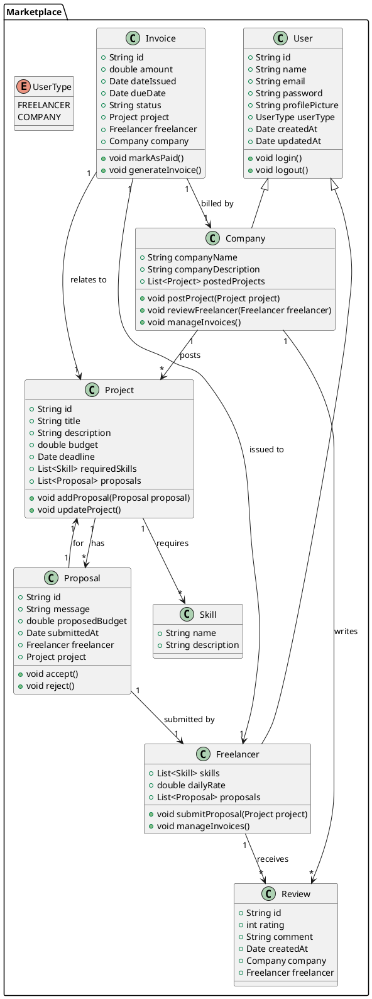

# Fiche Projet : Marketplace de Services Freelances

## 1. Titre du Projet
**ProTechLinker**

## 2. Contexte
Dans le monde actuel, de plus en plus de freelances et d'entreprises cherchent à se connecter rapidement et efficacement. Une plateforme dédiée peut faciliter cette connexion, permettant aux freelances de trouver des projets et aux entreprises de recruter facilement les talents dont elles ont besoin.

## 3. Objectifs du Projet
- Créer une plateforme en ligne qui met en relation des freelances et des entreprises.
- Améliorer l'expérience utilisateur pour les freelances et les entreprises.

## 4. Cibles Utilisateurs
- **Freelances** : Professionnels cherchant à offrir leurs services.
- **Entreprises** : Organismes cherchant à embaucher des freelances pour des projets spécifiques.

## 5. Fonctionnalités Clés
- **Pour les Freelances** :
    - Création de profil avec compétences, description et photo.
    - Recherche et filtrage de projets par catégories, compétences, budget et localisation.
    - Soumission de propositions personnalisées pour des projets.
    - Consultation et gestion des factures, avec suivi de leur état.
    - Évaluation des projets et des entreprises à travers un système d'avis.
    - Messagerie intégrée pour communiquer avec les entreprises.
    - Tableau de bord personnalisé affichant les projets en cours et les performances.

- **Pour les Entreprises** :
    - Création de profil entreprise avec informations et logo.
    - Publication de projets avec description, compétences requises et budget.
    - Consultation des propositions soumises par les freelances.
    - Évaluation des freelances à travers un système d'avis.
    - Gestion des factures envoyées par les freelances, avec historique des paiements.
    - Tableau de bord affichant les projets en cours et les statistiques de performance.
    - Système de notifications pour les nouvelles propositions et messages.

## 6. Technologies Utilisées
- **Backend** : Java avec Spring Boot pour le développement de l'API.
- **Frontend** : TypeScript avec (React ou Vue JS) pour l'interface utilisateur.
- **Base de Données** : MySQL ou PostgreSQL pour stocker les données des utilisateurs, projets et factures.
- **Autres Outils** : Git pour le contrôle de version, et Docker pour la conteneurisation des applications.

## 7. Diagramme de Classes
### Diagramme de Classes

## 9. Gestion de Projet
- Méthodologie : Agile (Scrum) pour permettre des itérations rapides et un retour d'information continu.
- Outils : Utilisation de Trello ou Jira pour la gestion des tâches et de GitHub pour le contrôle de version.